# 💫 Well hello there! 👋 I'm Natasha

I’m a **Software Developer & Tech Enthusiast** passionate about building scalable systems, crafting clean user experiences, and empowering young developers to confidently step into tech.

I enjoy working across the stack — from intuitive interfaces to robust backend systems — and I’m especially interested in products that solve real-world problems.

---

### 🔭 What I’m working on
- 🎟️ **Events Platform** — ticketing, payments & event discovery  
- 🐾 **Find My Vet** — locate nearby veterinary services in real-time  

### 🌱 Currently learning
- Advanced **Next.js**
- Backend architecture & system integration

### 👯 Open to collaborating on
- Open-source projects  
- Impact-driven platforms  
- Developer-focused tools & communities

### 💬 Ask me about
- Full-stack web development  
- JavaScript, React & Next.js  
- Backend architecture & clean APIs  
- Mentorship & growing confidently in tech

### 📫 Reach me
- 💼 [LinkedIn](https://www.linkedin.com/in/natashawangui/)
- 📧 [Email](mailto:natashaj221219@gmail.com)

😄 **Pronouns:** She/Her  
⚡ **Fun fact:** I love deep-diving into tech on weekends — or completely unplugging to recharge and dream up new ideas.

---

## 🔥 Skills Snapshot

**Frontend**
- JavaScript (Advanced)
- React, Next.js
- Tailwind CSS, Chakra UI
- Vue.js

**Backend**
- Node.js, Express
- Ruby on Rails
- RESTful APIs & backend integration

**Databases**
- MongoDB
- PostgreSQL
- MySQL
- Supabase
- Firebase

**Cloud & Deployment**
- AWS
- Azure
- Coolify
- Google Cloud
- Vercel
- Netlify
- Heroku
- Render

**Tools & Practices**
- Git & GitHub
- CI/CD
- Agile Methodologies
- Clean code & scalable architecture

---

## 💻 Tech Stack

---

## 📊 GitHub Stats

---

## 🏆 GitHub Trophies

---

### ✍️ Random Dev Quote

---

## 🤝 Let’s Connect
I’m always open to meaningful conversations, collaboration, and learning opportunities.  
If you’re building something exciting or just want to talk tech — let’s connect 🚀

---

